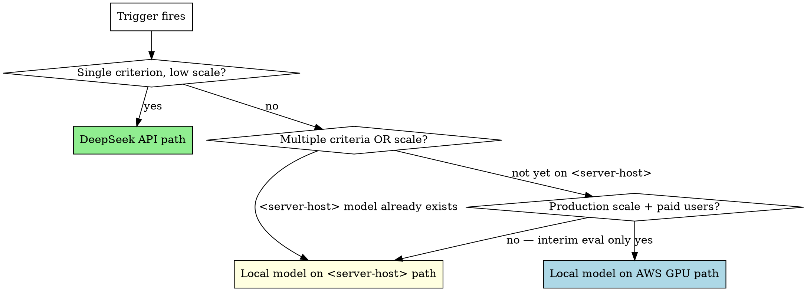

# Cairn — Local AI Simplifier Option (Deferred)

**Date:** 2026-05-10
**Status:** deferred-design — option captured for future trigger conditions
**Author:** plumb (Cairn build-out)
**Relates to:** [`2026-05-10-cairn-ai-native-amendment.md`](2026-05-10-cairn-ai-native-amendment.md) §3 (Simplifier)
**Eval kit:** [`cairn/eval/`](../../../cairn/eval/)

---

## Purpose

Cairn's simplifier currently uses Anthropic Claude via the `claude-code` subprocess provider. This is correct for the personal-substrate ceiling: Claude subscription absorbs the cost, quality is high, and there are no external users whose data sovereignty constrains the choice.

This document captures the **local-AI alternative** so the analysis isn't lost when conditions change. It does NOT propose immediate implementation. It documents:

1. The candidate (ZAYA1-8B and the broader 8B-class open-weight option)
2. Why it's not pursued right now
3. The specific trigger conditions that would flip the decision
4. The implementation shape if/when those triggers fire
5. What's already in place (the eval kit) so the future build is faster

---

## The candidate

### ZAYA1-8B (Zaya AI)

Per the Gemini evaluation captured in the conversation log of 2026-05-10, ZAYA1-8B has properties that fit Cairn's specific simplifier use case better than a generic 8B dense model:

| Property | Value | Why it matters for Cairn |
|---|---|---|
| Architecture | MoE, 0.7B active params | Inference latency ≈ 0.7B-class, not 8B-class. Important for the debounced-queue pattern (5-second window) to land summaries before the next push |
| LiveCodeBench | 65% (base) / 69% (reasoning) | Comparable to DeepSeek-R1, beats DeepSeek-Coder-7B. Cairn's input is ~80% code by content; code-strong matters |
| Markovian RSA | Reasoning harness, optional | Produces "this PR refactors X to prevent Y, though tradeoff Z" rather than paraphrase. Aligns with spec §3.1 (simplifier helps reviewers scrutinize, not just paraphrase) |
| VRAM footprint | 6-8 GB at INT4 | Comfortable on RTX 5090's 32 GB; can co-tenant with Forge's WakeStone work |
| Context window | 32K | Adequate for most PRs; constrains very large refactors. See open question 1 below |

### Alternates in the same class

If ZAYA1-8B isn't available or the eval shows it underperforms, equivalent-tier candidates:
- **Llama 3.1 8B** — broadest availability, no special features
- **Qwen 2.5 Coder 7B** — code-specialized
- **DeepSeek-Coder 7B / 33B** — code-specialized; 33B costs more VRAM but gains capability
- **Mistral Small 3.1 / Codestral** — Mistral's code variants

The eval kit at `cairn/eval/` works with any of these — the harness is engine-agnostic, only the model tag changes.

---

## Why this is deferred (not pursued now)

### Cost economics at personal-substrate scale

| Engine | Cost per summary | Summary volume per month |
|---|---|---|
| `claude-code` (subscription) | absorbed | unlimited within subscription |
| DeepSeek API | ~$0.0001 | 10K summaries = ~$1 |
| Self-hosted on AWS GPU | ~$365/mo (g4dn.xlarge 24/7) | flat regardless of volume |

For Cairn's current ceiling (one operator, dozens of PRs/month from her own agents), the AWS GPU would cost ~360× the actual API spend at DeepSeek prices, and the claude subscription is already paid. The local-model economics only work at scale that doesn't exist today.

### Implementation cost (not invisible)

A production local-model path requires:

1. **Bridle change**: extend the `openai-api` provider to accept a custom `endpoint_url`, OR extend `ollama-local` to accept a remote URL. Currently logged as a Plan 5 backlog item. ~30 lines of Go + tests + a coordinated PR with the bridle owner.
2. **<server-host>-side serving**: install ollama or vLLM in WSL2 with GPU access; pull/import the model; expose HTTP on tailnet. <server-host> is currently Windows + WSL2; the Linux transform is planned but unfinished.
3. **Cairn-side config swap**: trivial once bridle supports it — one PUT to `/api/cairn/v1/orgs/{owner}/summarizer` with `provider: openai-api, endpoint_url: http://dmon-tailnet-ip:11434/v1`.

The bridle change is the load-bearing piece. It's small, but it's a cross-repo coordination cost that Plumb (Cairn) and bridle's owner have to align on.

### Production uptime mismatch

<server-host> sleeps. From `project_sleep_tolerant_broker` memory: <operator-host> is portable and sleeps; the nexus broker on <server-host> is being made sleep-tolerant. If the simplifier depends on <server-host>-hosted inference, summaries will fail when <server-host> is asleep. Cairn's spec §3.7 already says failure is non-blocking ("summary unavailable"), so this is acceptable for MVP — but for a production-grade simplifier serving paid customers, this is an availability problem solvable only by paid AWS GPU.

---

## Trigger conditions — when this stops being deferred

The local-AI option becomes worth building when **at least one** of these is true:

### 1. Multi-tenant Cairn with paying users

Personal substrate (current ceiling) doesn't justify GPU spend. **If the deployment ceiling moves to "paid customers"** (per `project_cairn_deployment_ceiling`), then:
- AWS GPU spend (~$365–730/mo for g4dn or g5) gets absorbed into per-tenant pricing
- Sovereignty becomes a competitive feature ("your repo content never leaves the EU/your tailnet")
- DeepSeek API becomes risky (third-party seeing customer code) — local model becomes a feature, not a cost

This is the primary trigger. Until then, the option stays deferred.

### 2. Forge or another agent already needs a local 8B on <server-host>

If the inference server exists for unrelated reasons (WakeStone-adjacent AI work, Maren's rendering pipeline, future aspect needs), the marginal cost of adding Cairn as a second consumer drops to near-zero. The bridle change is still required, but the <server-host>-side serving setup is "free" because it's already there.

**Watch this**: if Forge (or any aspect) starts running ollama or vLLM on <server-host> for any reason, escalate this option from deferred to "evaluate next sprint."

### 3. Sovereignty becomes load-bearing

Per the spec amendment, current Cairn ceiling is personal-substrate; Anthropic seeing the operator's own repo content is acceptable. **If that changes** — regulatory pressure, threat-model shift, a contract that requires data-residency, or a security audit that flags Anthropic's data handling — the local-model path becomes mandatory rather than optional.

### 4. claude-code or DeepSeek become unavailable

Either provider disappears, changes terms unfavorably, or develops outage patterns that affect Cairn's reliability. Local model serves as the always-available fallback.

### 5. Cost reduction across many summaries

If Cairn ever scales to producing thousands of summaries per day for any reason (CI integration, broader agent fleet, etc.), DeepSeek becomes the next-cheapest option, and local serving becomes economical only above the AWS-GPU break-even (~30M tokens/month at DeepSeek prices, give or take).

---

## Decision tree (when a trigger fires)

The hierarchy: **DeepSeek API is the "cheap, fast, hosted" answer for low-scale needs; local-on-<server-host> is the "test or transitional" answer; local-on-AWS-GPU is the "production multi-tenant" answer.**

---

## Implementation shape (if/when triggered)

### Phase 0 — Eval (already possible)

The `cairn/eval/` kit (committed `a610a8fd5b`) lets you compare any combination of `claude-code` / DeepSeek / local-via-ollama against Cairn's actual prompt and a corpus of real PRs. Run this before committing to a swap. The eval is the input to the actual decision.

### Phase 1 — Bridle endpoint-URL extension

Cross-repo PR. ~30 lines of Go in bridle's `provider/openai/` package. Specifically:
- Accept `endpoint_url string` in `openai.Config`
- Default to `https://api.openai.com/v1` if empty
- Use the configured URL in HTTP requests
- Test against the OpenAI API itself (no regression) and an OpenAI-compat endpoint (ollama, vLLM, DeepSeek)

This change unlocks BOTH the DeepSeek path (different cloud-hosted endpoint, same protocol) and the local path (ollama-on-<server-host> endpoint, same protocol). One change, two unblocks.

### Phase 2a — DeepSeek path (small)

If trigger #5 only (cost reduction, single criterion):
1. Bridle change ships
2. Cairn config: `provider: "openai-api", endpoint_url: "https://api.deepseek.com/v1", model_id: "deepseek-chat", api_key: <DeepSeek key>`
3. Run a week side-by-side with claude-code; compare via cairn/eval
4. If quality holds, swap; keep claude-code as configured fallback for very-large PRs

Total work: ~half a day of integration + a week of side-by-side observation.

### Phase 2b — Local-on-<server-host> path (medium)

If trigger #2 (Forge brings ollama up) or #3 (sovereignty load-bearing without paid scale):
1. Bridle change ships
2. <server-host>-side: ollama or vLLM running on tailnet, serving the chosen model on `:11434/v1`
3. Cairn config: `provider: "openai-api", endpoint_url: "http://<dmon-tailnet-ip>:11434/v1", model_id: "<model-tag>", api_key: ""` (ollama doesn't enforce auth; the field is required by the API but ignored)
4. Run cairn/eval against samples; tune prompt or accept quality gap
5. Document tailnet dependency in runbook (sleep-tolerance fallback)

Total work: 1-2 days, mostly <server-host>-side configuration.

### Phase 2c — Local-on-AWS-GPU path (large)

If trigger #1 (paid multi-tenant) AND scale justifies dedicated GPU:
1. Bridle change ships
2. AWS infrastructure: dedicated `g4dn.xlarge` (or larger for multi-model serving) running ollama/vLLM, in same VPC as Cairn
3. Networking: private VPC route from Cairn to inference host
4. Operational: monitoring (CloudWatch + custom), backup model selection, autoscaling if traffic warrants
5. Cost discipline: tag all GPU spend, watch idle hours, consider Spot for non-prod
6. Compliance docs: where data flows, retention, etc.

Total work: 1-2 weeks. This is real production engineering.

---

## What's NOT in this option

- **Per-org choice of local vs hosted** — too complex for MVP. Pick one production engine. Run an eval if there's doubt. Anyone running a Cairn instance on their own infra can swap providers freely; that's the OSS escape hatch.
- **Model fine-tuning on Cairn-specific prompts** — interesting but vastly out of scope. The Markovian RSA reasoning is what makes ZAYA1-8B competitive; fine-tuning a smaller model to compete is a research project, not a Cairn deliverable.
- **Self-hosted Anthropic models** — Anthropic doesn't offer self-hosting. Bedrock is technically Anthropic-on-AWS but the data still goes to Anthropic infrastructure.

---

## Open questions / unknowns

These need answers before any of Phase 2a/2b/2c proceeds. Capture answers as comments in this doc when you find them.

### Q1: ZAYA1-8B context window vs Cairn's diff cap

Cairn's `BuildPRContextFromForgejo` (in `services/cairn/summarizer/events.go`) caps diff content at 512 KB ≈ 125K tokens at 4 chars/token. ZAYA1-8B's 32K context can't accept the full 125K cap. Mismatch — for very large PRs, the eval will see truncated input.

Options:
- Reduce Cairn's diff cap to fit (loses fidelity for large PRs across all engines)
- Per-engine truncation (clean but adds complexity)
- Fall through to claude-code (bigger context) for over-32K PRs, ZAYA for the rest

The fall-through path is the most practical. Cairn's spec §3.7 already supports per-org configuration, so per-org "primary engine + fallback engine" could fit if/when this matters.

### Q2: Mixed prose-and-code content quality

Gemini's eval focused on the code-reasoning benchmarks. Cairn's actual input is title + body + commit messages + diff — the first three are prose, only the diff is code. A code-strong but prose-weaker model could produce technically-accurate-but-flat summaries.

The cairn/eval kit can answer this empirically. Run a doc-only sample (`samples/002-doc-only-runbook.md` already exists) — if ZAYA produces a flat summary of a doc PR but claude-code captures the *why*, that's the prose gap manifesting.

### Q3: Reasoning-on cost/latency tradeoff

ZAYA1-8B's Markovian RSA is reportedly opt-in. Reasoning-on improves the "explain why" output but costs more tokens + wall time. Cairn's debounce is 5 seconds; if reasoning-on takes 8 seconds per summary, it still works (queues), but it changes the operator-perceived latency.

Test reasoning-on AND reasoning-off side-by-side in the eval. Decide per-org or per-prompt-type which to use. The simpler default is reasoning-on for PR-level summaries, off for any future commit-level (volume is much higher there).

### Q4: <server-host> serving software choice

ollama is operationally simple but quantization options are fewer; vLLM is faster + more flexible but more complex to run. If Forge (or anyone) sets up serving on <server-host>, defer to their choice — Cairn's adapter doesn't care which serves the OpenAI-compat endpoint.

### Q5: Cost of bridle backlog

The "extend openai-api with endpoint_url" change is logged as a backlog item. **Has it been done yet?** Worth checking before writing this doc as a "future build" — if it's already shipped in bridle, Phase 1 is already complete and this doc is over-conservative on implementation cost.

---

## Cross-references

| Doc / artifact | Relationship |
|---|---|
| `docs/cairn/specs/2026-05-09-cairn-foundation-design.md` | Original Cairn spec (pre-AI-native) |
| `docs/cairn/specs/2026-05-10-cairn-ai-native-amendment.md` | §3 covers simplifier; §3.4 says single-prompt MVP; §3.3 says provider is per-org configurable |
| `docs/cairn/plans/2026-05-10-cairn-simplifier.md` | Plan 5 — "Deferred to follow-up" lists bridle endpoint-URL gap |
| `docs/cairn/plans/2026-05-10-cairn-human-review-enforcement.md` | Plan 6 — unrelated to simplifier engine choice |
| `cairn/deploy/deployment-runbook.md` §15.5 | Operator-facing notes including bridle backlog and admin-API-only configuration |
| `cairn/eval/` | Comparison harness — already in place |
| Memory: `project_cairn_deployment_ceiling` | Personal-substrate ceiling decision — relaxes only if multi-tenant |
| Memory: `project_sleep_tolerant_broker` | <server-host> sleep behavior — affects local-on-<server-host> availability |
| Memory: `project_team_current_state` | Forge runs WSL2 Ubuntu on <server-host> currently; Linux transform pending |

---

## Maintenance

This doc is a deferred-design capture, not a living plan. Update it when:

1. **A trigger condition fires** — note it here, then promote/branch the implementation phase into a real plan in `docs/cairn/plans/`
2. **Bridle's openai-api endpoint-URL gap is closed** — strike Phase 1 cost; Phase 2a becomes "config swap, run eval"
3. **A new candidate model surpasses ZAYA1-8B for the simplifier use case** — replace the candidate; the rest of the analysis still holds
4. **Cost economics shift** (Anthropic raises prices, DeepSeek raises prices, AWS GPU drops) — re-do the table in §"Why this is deferred"
5. **The deployment ceiling moves** (personal-substrate → multi-tenant) — the trigger conditions become urgent rather than hypothetical

When a real implementation plan replaces this option, mark this doc's status as **superseded by `docs/cairn/plans/<plan-file>`** and don't delete it — the deferred-design history is useful even after the decision is made.
